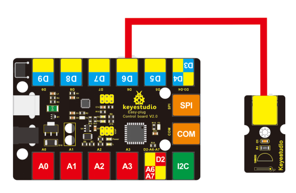
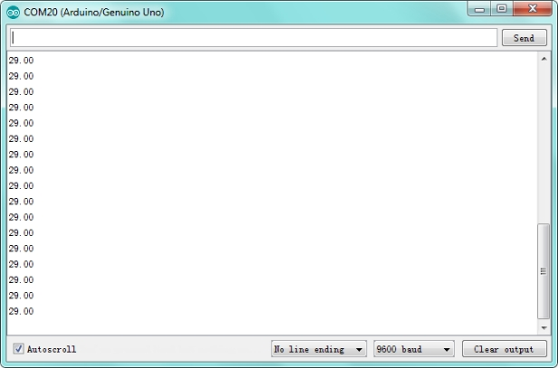

# KS0124 keyestudio EASY plug DS18B20 Temperature Sensor


## 1. Introduction

The DS18B20 temperature sensor is exactly what it sounds like - a sensor used to measure ambient temperature.

The usable temperature ranges from -55°C to +125°C. It also supports multi-point mesh networking.

While there are many types of temperature sensors available in the market, the DS18B20 temperature sensor is the best choice in applications which require high accuracy and high reliability.

For electronic enthusiasts and hobbyists, the DS18B20 is a good start for learning and developing temperature-dependent prototypes.

This module should be used together with EASY plug control board.

**Special Note:**

The sensor/module is equipped with the RJ11 6P6C interface, compatible with our keyestudio EASY plug Control Board with RJ11 6P6C interface.

If you have the control board of other brands, it is also equipped with the RJ11 6P6C interface but has different internal line sequence, can’t be used compatibly with our sensor/module.

## 2. Specification

- Connector: Easy plug
- Supply Voltage: 3.3V to 5V
- Temperature range: -55°C to +125°C
- Interface: Digital

## 3. Technical Details

- Dimensions: 38mm * 20mm * 18mm
- Weight: 4.4g

## 4. Connect It Up

Connect the EASY Plug DS18B20 temperature sensor to control board using an RJ11 cable. Then connect the control board to your PC with a USB cable.



## 5. Upload the Code

Download  Resource:  [Resource](./Resource)

Note： before uploading the code, you need to import the library files; otherwise, the code upload will fail.

```c
#include <OneWire.h>
int DS18S20_Pin = 6; //DS18S20 Signal pin on digital pin 6
//Temperature chip i/o
OneWire ds(DS18S20_Pin);// on digital pin 6

void setup(void) 
{
	Serial.begin(9600);
}

void loop(void) 
{
    float temperature = getTemp();
    Serial.println(temperature);
    delay(100); //to slow down the output so it is easier to read
}

float getTemp()
{
    //returns the temperature from one DS18S20 in DEG Celsius
    byte data[12];
    byte addr[8];
    if ( !ds.search(addr)) 
    {
        //no more sensors on chain, reset search
        ds.reset_search();
        return -1000;
	}
    if ( OneWire::crc8( addr, 7) != addr[7]) 
    {
        Serial.println("CRC is not valid!");
        return -1000;
    }
    if ( addr[0] != 0x10 && addr[0] != 0x28) 
    {
        Serial.print("Device is not recognized");
        return -1000;
    }
    ds.reset();
    ds.select(addr);
    ds.write(0x44,1); // start conversion, with parasite power on at the end
    byte present = ds.reset();
    ds.select(addr);
    ds.write(0xBE); // Read Scratchpad
    for (int i = 0; i < 9; i++) 
    { 
        // we need 9 bytes
        data[i] = ds.read();
    }
    ds.reset_search();
    byte MSB = data[1];
    byte LSB = data[0];
    float tempRead = ((MSB << 8) | LSB); //using two's compliment
    float TemperatureSum = tempRead / 16;
    return TemperatureSum;
}
```

## 6. Result

Done uploading the code, you should be able to read the temperature your temperature sensor is detecting on the serial monitor in the Arduino IDE. 

